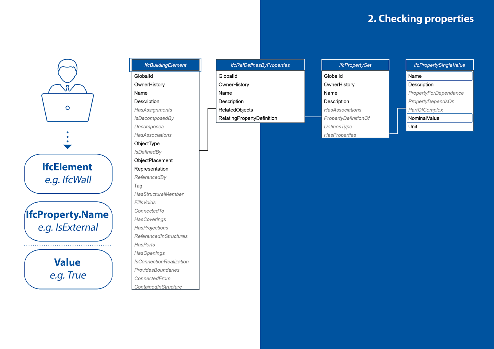
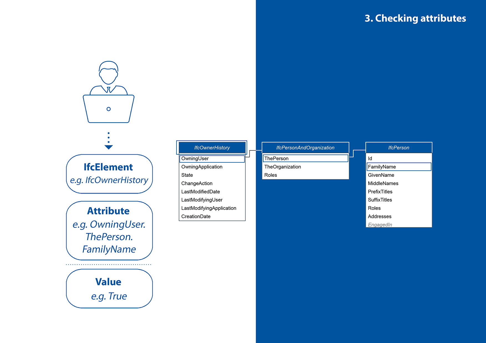
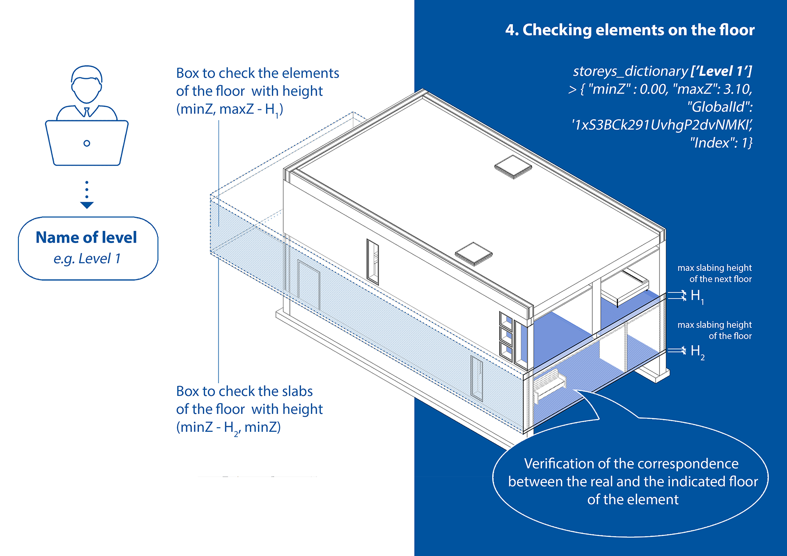
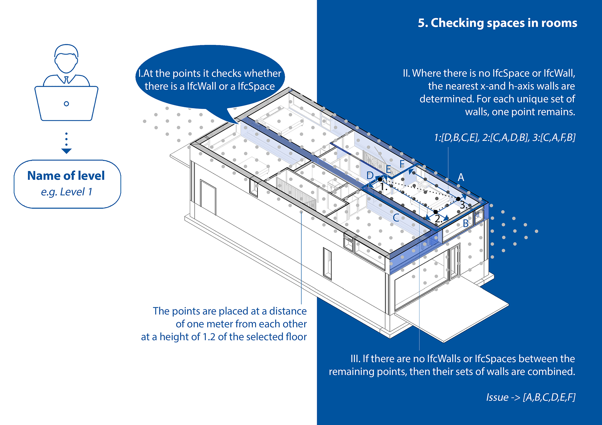

# IFC-checking and BCF-Generator

In this project 5 types of checks were developed that check elements, properties, attributes, elements on the floor and the presence of spaces between the walls. The result is formatted as a BCF. For the BCF format, an algorithm was prescribed for automatically determining the camera position and view settings, which provides better feedback.

## IFC-checking

